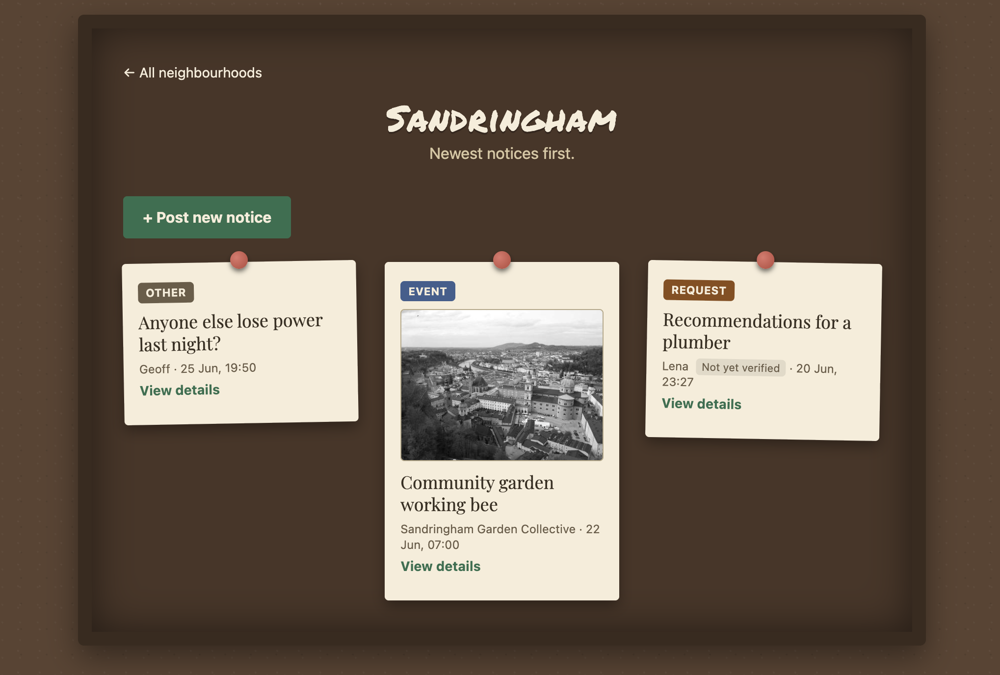

# Neighbourhood Noticeboard Demo

A lightweight community noticeboard — residents post notices, reply to each other, and a legacy data import plus a trust & safety pipeline handle the messier real-world parts. Built with SvelteKit, TypeScript, and Tailwind CSS.

**Live demo: [neighbourhood-noticeboard.onrender.com](https://neighbourhood-noticeboard.onrender.com)** (runs on Render's free tier, so the first load after a period of inactivity can take few seconds to wake up.)



## Deliverables

- [`docs/DECISIONS.md`](docs/DECISIONS.md) — architecture, key decisions, trust & safety reasoning, scope cuts, how AI was used, what's next.
- [`docs/SUMMARY.md`](docs/SUMMARY.md) — non-technical summary of what was built and why it matters.
- [`docs/SCENARIOS.md`](docs/SCENARIOS.md) — written answers to the scenario questions.
- [`docs/PLAN.md`](docs/PLAN.md) — live progress checklist.

## Getting Started

### Prerequisites

- [Node](https://nodejs.org/) 20+
- [pnpm](https://pnpm.io/) 10.x

### Run locally

```sh
git clone https://github.com/moizp/stuff-test.git
cd stuff-test
pnpm install
pnpm dev
```

`pnpm dev` opens the app in your default browser automatically. It boots with an in-memory store, reseeded from `seed-notices.json` via the import pipeline on every start — no database setup needed.

Other useful commands:

```sh
pnpm test      # run the vitest suite
pnpm check     # type-check (svelte-check)
pnpm build     # production build
pnpm preview   # preview the production build locally
```

### Deploy

Deployed to [Render](https://render.com)'s free tier as a single Node process (`adapter-node`) serving both the API and the built frontend.

- **Build command:** `pnpm install && pnpm build`
- **Start command:** `node build`
- **Note:** the free instance sleeps after inactivity — the first request after idle can take several seconds while it wakes up. The frontend pings `GET /health` on load to kick off the wake-up early.

## What's built

All must-do features are built and tested: legacy import, listing/creating/replying to notices per neighbourhood, and the trust & safety pipeline, plus a full UI (card customisation, popup detail view, accessibility pass) and a live deployment. Full progress lives in [`docs/PLAN.md`](docs/PLAN.md).

## Folder structure

SvelteKit enforces the frontend/backend split structurally, not just by convention — the build throws if client code imports anything under `server/`. That split maps directly onto the architecture in `DECISIONS.md`:

```
docs/                # DECISIONS.md, SUMMARY.md, SCENARIOS.md, PLAN.md
src/
  routes/            # frontend — pages + API endpoints (+page.svelte, +server.ts)
  lib/
    server/          # backend-only, never bundled for the client
      services/      # business logic (createNotice, trust & safety, etc.)
      repository/    # data access, swappable storage interface
      import/        # legacy seed-notices.json → createNotice() pipeline
    shared/          # types used by both frontend and backend
    components/      # frontend UI (notice card, detail dialog, create form, viewer badge)
```

Tests are colocated with the code they cover (e.g. `normalize.test.ts` next to `normalize.ts`), not held in a separate `tests/` tree — keeps a unit and its test moving together under one architectural boundary.
