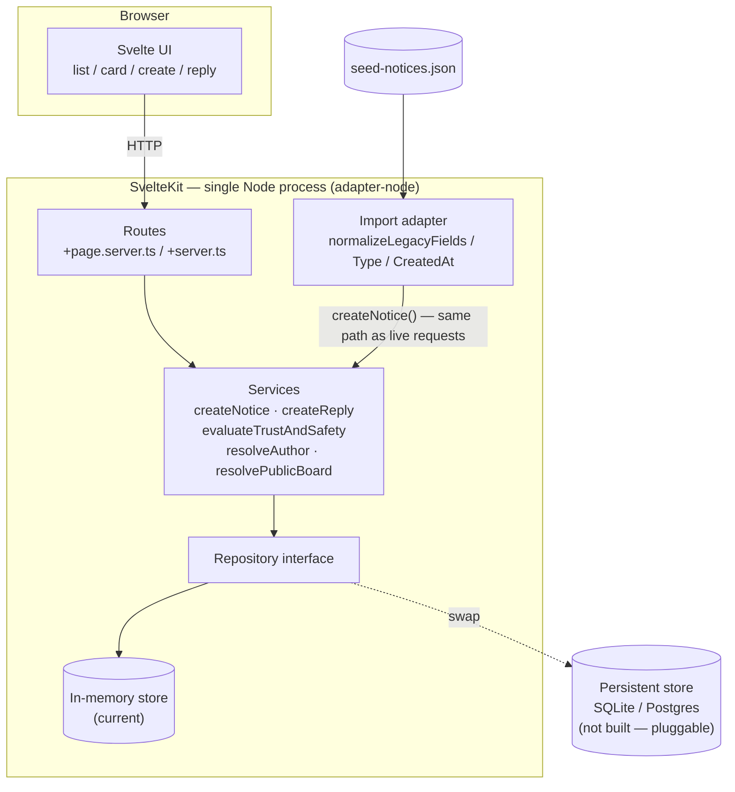

# Decisions

## Stack
- SvelteKit (pnpm, Vite, Node, Svelte), single package, `adapter-node`. File-based routing covers both pages and API endpoints in one project — one dev server, one build, one deploy target.
- `+server.js` endpoints are thin route handlers only; business logic lives in `src/lib/server/services`, data access in `src/lib/server/repository` — keeps the layered architecture (routes → services → repository) we'd committed to regardless of framework.
- Considered a separate Express/Fastify backend + plain Svelte+Vite frontend (e.g. pnpm workspaces) for cleaner separation, but rejected: two dev servers and a proxy config for no real benefit, since we're deploying both together as one Node process anyway (see Deployment below).

## Architecture
- Layering: `routes` (`+page.server.ts` / `+server.ts`, thin handlers only) → `services` (business logic, incl. trust & safety) → `repository` (data access, swappable storage interface). Same layering regardless of framework — see Stack above.
- Trust & safety evaluation and legacy-data normalization are pure functions — no framework/DB coupling, independently testable in isolation (see Testing).
- Legacy import is isolated in one module and never writes to the repository directly — it normalizes shapes, then calls the same `createNotice()` service a live request (or a future third-party integration) would use. See "Legacy import" below.
- Frontend: components split by responsibility (list, notice card, reply thread, create form), data-fetching separated from presentation.



## Testing
- Tests are colocated with the code under test (e.g. `normalize.test.ts` beside `normalize.ts`) rather than a parallel `tests/` tree — a unit and its test move together, and it's obvious at a glance what has coverage and what doesn't.
- `vitest` wired up (`pnpm test`). 27 unit/integration tests across the repository, services (trust & safety, users, notices, replies, noticeboards), and the import pipeline — including an end-to-end test running the real import against `seed-notices.json` to validate our import assumptions hold against actual data, not just synthetic examples.
- Not building exhaustive coverage (no route/UI tests) — explicitly not required by the brief, and would eat into time better spent on the must-do features. The point being demonstrated is that the architecture *is* testable (pure functions, layered services, no framework/DB coupling required), not full coverage.

## Storage
- In-memory, behind a repository interface, used identically for local dev and the deployed demo — one implementation, one less moving part to build/maintain for a 4-hour exercise. Reseeded from `seed-notices.json` on every process start, so state is always consistent and known.
- The repository interface means a persistent store (SQLite, Postgres, etc.) can be plugged in later without touching services/routes — deliberately not built now, since nothing in the brief requires persistence across restarts.
- Considered reusing the Yjs CRDT + WebSocket relay + LevelDB stack from `buy-together`, but it's built for offline multi-device sync of a shared doc, not relational data with joins/dedup/derived trust scores — wrong shape for this problem, and pulls in sync infrastructure nothing in the brief asks for.

## Deployment (deliberate scope addition, not required by the brief)
- Deploying to Render's free tier so the exercise is easily demoable to multiple people, not just runnable locally. Single Node process serves both API and built frontend — one URL, no CORS wiring.
- Trade-off accepted: free instance sleeps after inactivity, first request after idle takes several seconds to wake. Fine for a demo link, not for production — frontend pings a health endpoint on load to start the wake-up early.

## UI direction
- Noticeboard visual identity via styling only — pinned/postcard-style notice cards, corkboard-texture background, warm paper palette — in a normal scrollable grid. Not a true interactive pan/zoom canvas: that's real UI engineering (drag physics, hit-testing, accessibility rework) for a feature outside the grading criteria, and fights the "newest first" requirement, which has no natural equivalent in a freeform spatial layout. Full canvas interaction is in "what I'd do with more time."
- Card face is customizable: poster can set an image and a short caption (custom font) shown on the card; clicking opens the full notice (title, body, author, timestamp, replies).
- Image is a **pasted URL**, not a file upload — we have no blob storage (in-memory only), and building upload infra isn't justified here.
- Font is a **small preset list** (`marker` | `typewriter` | `handwritten` | `classic`, applied as a CSS class), not arbitrary font upload/selection — one enum field, no font-loading complexity.

## Data model

```
User {
  id, name, verified, trustScore, createdAt
}

Circle {                      // directed: ownerId added memberId to their circle
  ownerId, memberId, createdAt
}

Noticeboard {                 // replaces bare `neighbourhood` string
  id, name, visibility: 'public' | 'private', ownerId (null for public)
}
// private board access = owner + owner's Circle (Option A: no separate membership table)

Notice {
  id, legacyId, boardId, type: 'offer'|'request'|'event'|'alert'|'other',
  title, body, authorId (nullable → unknown author), createdAt,
  status: 'visible'|'pending_review'|'hidden', importFlags: string[],
  cardImageUrl: string | null,   // pasted URL, no upload
  cardCaption: string | null,    // short line for the card face, falls back to title
  cardFont: 'marker'|'typewriter'|'handwritten'|'classic' | null
}

Reply {
  id, noticeId, authorId (nullable), body, createdAt,
  status: 'visible'|'pending_review'|'hidden'   // same trust & safety pipeline as Notice
}

TrustEvent {                  // append-only log; trustScore derives from this
  id, userId, delta, reason, noticeId (nullable), createdAt
}
```

- Author is a `User` reference, not a free-text string, so a trust score has somewhere to live.
- Private noticeboard access = owner + owner's `Circle` (no separate membership table — kept it to one relationship, not two).
- `trustScore` is derived from an append-only `TrustEvent` log rather than a mutable field, so score changes have a reason attached.
- Scope for this round: full schema above modeled; only a thin behavioral slice built — public boards fully working, private boards enforced via one membership check (owner + circle), minimal/no UI for circle management beyond add/list. Anything beyond that is "designed, not built" (see "What I'd do with more time").

## Legacy import (`seed-notices.json`)
- Import is a two-step pipeline: a legacy-specific adapter normalizes messy records into the canonical `CreateNoticeInput` shape, then hands off to the same `createNotice()` service call a live request (frontend, or a future third-party integration) would use. No direct repository writes from the import path — validation, trust-scoring, and dedup apply uniformly regardless of source.
- Field drift (`subject`/`text`, `suburb`) normalized to `title`/`body`/`neighbourhood` on ingest.
- `type` casing normalized to a lowercase enum; missing/null `type` bucketed as `other` rather than guessed from title text — kept import logic simple and honest.
- Dates arrive in 5 different formats (ISO8601, `DD/MM/YYYY`, Unix epoch int, date-only, empty string). All parsed; unparseable/empty falls back to import time and is flagged in `importFlags`, not dropped.
- Author identity resolved by exact trimmed name match. Known limitation: two real people sharing a display name would incorrectly merge into one `User` — accepted, since real identity resolution needs auth, which is out of scope.
- Where an author's `verified` flag conflicts across their legacy records, most-restrictive-wins (any unverified record marks the user unverified) — false negatives (treating a bad actor as verified) are worse than false positives in a trust & safety context.
- Duplicate near-identical notices (same title+author+neighbourhood+body) deduped, earliest timestamp kept.
- Each unique legacy neighbourhood becomes a public `Noticeboard` on import.

## Scope cuts (this round)
- Private noticeboards + circles: full schema modeled, but only a thin behavioral slice built — public boards fully working, private boards enforced via one membership check (owner + circle), minimal/no UI for circle management. Full invite flows, richer ACLs etc. are designed but not built.
- No auth/login, production hardening, exhaustive tests, brand guidelines, personas, PWA, gated CI/CD, or an LLM fine-tuning roadmap — none required by the brief; see "What I'd do with more time" for each. (Deployment itself *is* in scope here — a deliberate addition for demoability, not a cut — see Deployment above.)

## Trust & safety
- Two independent signals combine to set `Notice.status`: `verified` (existing data) and a lightweight heuristic scan (ALL-CAPS-heavy titles, money/scam keywords like "guaranteed income"/"DM me"/"$"/"whatsapp", a small abuse/threat keyword list) — pragmatic pattern-matching, not real moderation/NLP.

  | Verified | Heuristic flags? | Status | UI treatment |
  |---|---|---|---|
  | true | — | `visible` | shown normally |
  | false | no | `visible` | shown, labeled "Unverified resident" |
  | false | yes | `pending_review` | excluded from public list; author still sees their own |
  | — | severe (abuse/threat) | `hidden` | excluded entirely, logged |

- **Label-by-default rather than hold-all-unverified**: most unverified posts in the seed data (plumber recommendation, moving boxes) are ordinary legitimate requests. Holding everything unverified would empty the board and doesn't match the actual risk, which is content-shaped, not verification-shaped alone.
- **Rejected down-ranking**: conflicts with the brief's explicit "newest first" requirement — kept sort order literal rather than introducing a second sort key to explain.
- **Rejected rate-limiting**: needs request-frequency tracking keyed on a session/identity we don't have without real auth — weak fit, noted as a "would add" instead.
- Implemented as one pure function, `evaluateTrustAndSafety(content, author)`, called from `createNotice()`/`createReply()` — same path for live requests and the legacy import (both go through the same service call, per the import decision above).
- Every flag/hold/hide writes a `TrustEvent` with a reason and moves `trustScore` down, so flagged legacy entries (the scam reposts, the abusive post) end up with both a lower score and an audit trail, not just a hidden post.
- Applied against the legacy data: the two "GUARANTEED INCOME" spam posts and the threatening/abusive post are the entries expected to land in `pending_review`/`hidden`; ordinary unverified requests/offers stay `visible` with a label. Confirmed by an end-to-end test running the real import against `seed-notices.json`.
- Trust score baselines: verified authors start at 70, unverified at 30 (0–100 scale); flags subtract from there (spam pattern -10, shouting title -5, abusive language -30).
- Open implication, not yet decided: showing "your own pending post" needs *some* notion of "who's browsing" without real auth — likely a simple current-user picker in the demo UI, to be settled during frontend planning.

## What I'd do with more time
- Persistent storage (SQLite/Postgres) via the repository interface — currently in-memory everywhere, so state resets on every restart.
- True interactive pan/zoom canvas noticeboard (spatial card placement, drag/zoom, accessibility rework) — current UI gets the noticeboard *feel* via styling only, in a standard scrollable grid.
- Auth/login (real identity, so author resolution isn't name-matching).
- Public ingestion API for real third parties (API keys, rate limiting, request validation at the HTTP boundary). Currently, the internal `createNotice()` interface is shaped to support this, but no auth'd endpoint is exposed externally.
- Full circle management UI (invite flows, richer ACLs beyond owner+circle).
- Exhaustive test coverage — route/UI tests and edge cases beyond the core logic aren't covered; see "Testing" above for what is.
- Gated CI/CD pipeline.
- Production hardening (rate limiting, monitoring, error tracking) and a real persistent-store deploy. Note: our in-memory store resets on every restart by design (fine for a demo); a production deploy would swap in a persistent store via the repository interface — Turso/managed Postgres suit serverless hosts (Vercel's filesystem is ephemeral/non-shared across instances; GitHub Pages has no backend runtime at all) better than a single SQLite file would.
- Brand guideline (tone, colour, typography) and a properly designed UI.
- User personas and UX research to validate the noticeboard/circle/trust-score flows.
- PWA features (offline support, installability, push notifications).
- Content-based moderation (e.g. spam/profanity detection) beyond the verified-flag-driven trust & safety rule — the questionable legacy entries were handled via trust score/status, not NLP-based classification.
- Scalability work: pagination, indexing, background job queue for moderation — none needed at this data volume, but noted for production.
