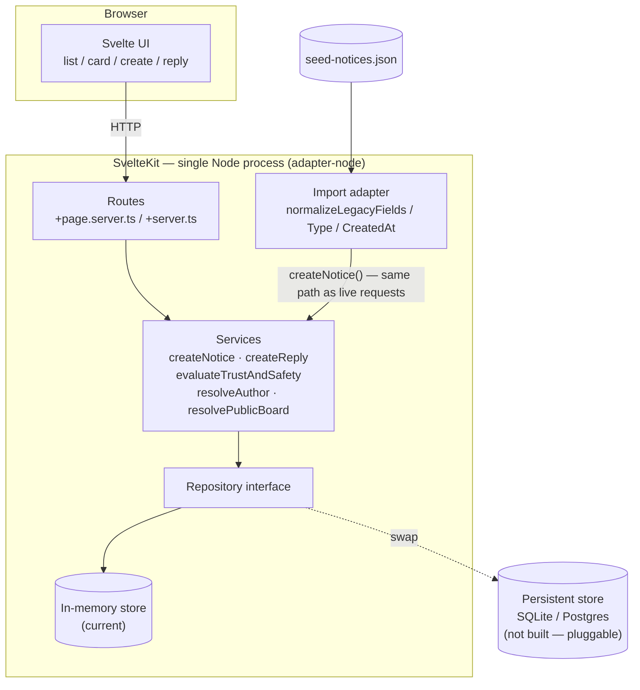

# Decisions

## Stack

- SvelteKit (pnpm, Vite, Node, Svelte), single package, `adapter-node`. File-based routing covers both pages and API endpoints in one project — one dev server, one build, one deploy target.
- Styling is Tailwind CSS v4 (`@tailwindcss/vite`), not hand-written CSS — the noticeboard's colors/fonts are theme tokens in `src/app.css` (`@theme`), most layout is inline utility classes, and a handful of `@utility` classes cover compound/pseudo-element patterns reused across components (`pin-card`, `board-frame`, `paper-form`) rather than repeating long class strings per instance.
- `+server.js` endpoints are thin route handlers only; business logic lives in `src/lib/server/services`, data access in `src/lib/server/repository` — keeps the layered architecture (routes → services → repository) we'd committed to regardless of framework.
- Considered a separate Express/Fastify backend + plain Svelte+Vite frontend (e.g. pnpm workspaces) for cleaner separation, but rejected: two dev servers and a proxy config for no real benefit, since we're deploying both together as one Node process anyway (see Deployment below).

## Architecture

- Layering: `routes` (`+page.server.ts` / `+server.ts`, thin handlers only) → `services` (business logic, incl. trust & safety) → `repository` (data access, swappable storage interface). Same layering regardless of framework — see Stack above.
- Trust & safety evaluation and legacy-data normalization are pure functions — no framework/DB coupling, independently testable in isolation (see Testing).
- Legacy import is isolated in one module and never writes to the repository directly — it normalizes shapes, then calls the same `createNotice()` service a live request (or a future third-party integration) would use. See "Legacy import" below.
- Frontend: components split by responsibility (list, notice card, reply thread, create form), data-fetching separated from presentation.



## Testing

- Tests are colocated with the code under test (e.g. `normalize.test.ts` beside `normalize.ts`) rather than a parallel `tests/` tree — a unit and its test move together, and it's obvious at a glance what has coverage and what doesn't.
- `vitest` wired up (`pnpm test`). 27 unit/integration tests across the repository, services (trust & safety, users, notices, replies, noticeboards), and the import pipeline — including an end-to-end test running the real import against `seed-notices.json` to validate our import assumptions hold against actual data, not just synthetic examples.
- Not building exhaustive coverage (no route/UI tests) — explicitly not required by the brief, and would eat into time better spent on the must-do features. The point being demonstrated is that the architecture _is_ testable (pure functions, layered services, no framework/DB coupling required), not full coverage.

## Storage

- In-memory, behind a repository interface, used identically for local dev and the deployed demo — one implementation, one less moving part to build/maintain for a 4-hour exercise. Reseeded from `seed-notices.json` on every process start, so state is always consistent and known.
- The repository interface means a persistent store (SQLite, Postgres, etc.) can be plugged in later without touching services/routes — deliberately not built now, since nothing in the brief requires persistence across restarts.
- Considered reusing the Yjs CRDT + WebSocket relay + LevelDB stack from `buy-together`, but it's built for offline multi-device sync of a shared doc, not relational data with joins/dedup/derived trust scores — wrong shape for this problem, and pulls in sync infrastructure nothing in the brief asks for.

## Deployment (deliberate scope addition, not required by the brief)

- Deploying to Render's free tier so the exercise is easily demoable to multiple people, not just runnable locally. Single Node process serves both API and built frontend — one URL, no CORS wiring.
- Trade-off accepted: free instance sleeps after inactivity, first request after idle takes several seconds to wake. Fine for a demo link, not for production — frontend pings a health endpoint on load to start the wake-up early.

## UI direction

- **Objective**: make the UI simple and seamless enough that posting feels as easy as putting up a sign on a noticeboard — the standard the rest of this section's choices (styling-only board identity, minimal-field forms, no login) are aimed at.
- Noticeboard visual identity via styling only — pinned/postcard-style notice cards, corkboard-texture background, warm paper palette, and a thick wood picture-frame border (`page-frame` in `app.css`) around the whole page — in a normal scrollable grid. Not a true interactive pan/zoom canvas: that's real UI engineering (drag physics, hit-testing, accessibility rework) for a feature outside the grading criteria, and fights the "newest first" requirement, which has no natural equivalent in a freeform spatial layout. Full canvas interaction is in "what I'd do with more time." The frame lives once at the layout level rather than nested per-page, so notices sit directly on the textured corkboard background inside it instead of a second, redundant frame.
- Card face is customizable: poster can set an image and a short caption (custom font) shown on the card; clicking opens the full notice (title, body, author, timestamp, replies).
- Image is a **pasted URL**, not a file upload — we have no blob storage (in-memory only), and building upload infra isn't justified here.
- Font is a **small preset list** (`marker` | `typewriter` | `handwritten` | `classic`, applied as a CSS class), not arbitrary font upload/selection — one enum field, no font-loading complexity.
- Detail view is a single shared `<dialog>` (`NoticeDetailDialog.svelte`), not per-card inline expansion and not a separate route — at most one notice's full detail is ever open at a time (opening a different card swaps the dialog's content rather than stacking a second view), and the newest-first list stays the one place ordering is defined, with no extra routing for a feature the brief doesn't ask to be a distinct page. Native `<dialog>` gives focus trapping, `Escape`-to-close, and backdrop-click-to-close for free. `NoticeCard.svelte` only renders the card face; the board page (`+page.svelte`) holds which notice id is open and passes it down.
- Open/close animation (scale 50%→100% + fade, reversed on dismiss) is plain CSS (`@starting-style` + `transition-behavior: allow-discrete`) in a scoped `<style>` block in `NoticeDetailDialog.svelte`, not a Svelte `transition:` directive — the dialog is shown/hidden imperatively via `showModal()`/`close()`, not by Svelte adding/removing it from the DOM via `{#if}`, so Svelte's built-in transitions don't apply to it. `@starting-style` is the standard modern technique for animating a native `<dialog>`'s open _and_ close symmetrically (the browser defers the discrete `display`/top-layer removal until the transition finishes), and it's the one deliberate exception to "styling is Tailwind utilities" (see "Stack") — this specific CSS feature has no Tailwind utility equivalent. Respects `prefers-reduced-motion`.
- Notice creation is scoped to the board currently being viewed (neighbourhood isn't a free-text field on the form) — matches the brief's "list notices for a given neighbourhood" framing; picking a different neighbourhood happens by navigating to that board first.
- Current-user picker (see PLAN.md) is matched against `User.name` by the same exact-trimmed-name resolution as import/author resolution — not a real session, just enough to let a `pending_review` author see their own post per the UI-treatment table below.
- Create/reply forms are plain SvelteKit form actions (`method="POST"`, no `use:enhance`) — they work fully with JS disabled or failed to load, not just degraded. Deliberate, not an oversight: a neighbourhood noticeboard skews toward residents on older phones, patchy home broadband, or public/library wifi, where JS bundles are the first thing to fail or arrive slowly. The trade-off is a full-page reload per submit instead of an optimistic/in-place update — acceptable here, and `use:enhance` can be layered on later as a pure progressive enhancement without changing this behaviour.

## Current-user identity

- Stored in the browser's `localStorage` (`ViewerBadge.svelte`), not a cookie. Chosen over a cookie because it's a device preference the app itself has no need to see server-side by default — it doesn't gate access to anything (there's no auth), it's not needed on every request the way a session token would be, and it's easy for a resident to inspect/clear from browser settings without touching server state. A cookie would work too, but would be sending "which name are you posting as" to the server on every request for a purely client-side convenience.
- The one place the server _does_ need it is deciding whether to include a viewer's own `pending_review` notice/reply in an SSR-rendered list (see "Trust & safety" below) — `localStorage` isn't visible to the server, so `ViewerBadge.svelte` syncs it into a `?viewer=` query param via a client-side redirect whenever it's out of sync, and `+layout.server.ts` reads it from there into `viewerName` for every page's `load`. Create/reply forms carry it forward as a hidden field (a `?/action` URL drops the rest of the query string per normal relative-URL resolution, so it wouldn't survive the POST otherwise) so the post-submit redirect lands back on the same `?viewer=` URL.

## Tooling

- Prettier (`pnpm format` / `format:check`), with `prettier-plugin-svelte` and `prettier-plugin-tailwindcss` — the latter auto-sorts Tailwind classes into a canonical order on save, so class strings stay consistent without manual discipline. Editor config in `.vscode/settings.json` runs it on save.
- Written content (docs, comments, commit messages, UI copy) uses New Zealand English spelling — matches the audience the noticeboard is for, and `<html lang="en-NZ">` reflects the same choice for assistive technology.

## Accessibility

- `<html lang="en-NZ">` (was generic `en`) so screen readers use correct pronunciation/hyphenation rules.
- A visually-hidden "Skip to content" link (`.skip-link` in `app.css`) as the first focusable element, since `ViewerBadge` is fixed top-right and would otherwise be the first stop for every keyboard user on every page.
- Page content wrapped in a `<main>` landmark (`+layout.svelte`) rather than a bare `<div>`.
- A single global `:focus-visible` outline (`app.css`) rather than relying on each browser's/component's own default, so keyboard focus is consistently visible across every button, link, and input.
- The two expand/collapse toggles (a notice's "View details", and the board page's "+ Post new notice") are proper disclosure widgets: `aria-expanded` reflects state and `aria-controls` points at the region they reveal.
- Notice card images get real `alt` text (`cardCaption` or `title`, whichever the card itself displays) instead of `alt=""` — they're poster-chosen content images, not decoration, even though we don't collect a dedicated alt-text field from the poster (noted under "what I'd do with more time").
- Heading levels no longer skip: a notice's expanded title is `<h2>` and its "Replies" heading is `<h3>`, following the page's own `<h1>`, rather than jumping straight to `<h3>`/`<h4>`.
- `notice-type-tag--request` (`warn`) and `notice-type-tag--event` (`event`) theme colours were darkened — the originals measured 4.41:1 and 4.36:1 contrast against the white label text they carry, just under the WCAG AA threshold (4.5:1 for text this size); the darkened values measure ~5.6:1 and ~5.5:1. Every other text/background pairing in the palette was checked and already clears AA.
- The `ViewerBadge` toggle button's background changed from a semi-transparent black overlay to an opaque `board-dark` fill, since as a `position: fixed` element it can sit over varying content (paper cards, board background) and a translucent overlay's effective contrast depends on whatever's behind it — an opaque background guarantees the contrast ratio holds regardless of scroll position.
- Not done: no full screen-reader walkthrough or automated audit (e.g. axe) was run — the above is a manual pass against the app's actual markup and computed colour contrast, not exhaustive WCAG conformance testing.
- **Reported by user**: neighbourhood-list links weren't reachable by <kbd>Tab</kbd>. Root cause is a macOS Safari default, not a markup bug — Safari's Tab key only cycles through form controls by default, skipping links and buttons entirely, unless "Full Keyboard Access" is turned on (System Settings → Keyboard, or per-press with `Option+Tab`). Every `<a href>` in the app was written correctly (natively focusable per spec, no `tabindex` needed in a standards-compliant browser), so the issue only shows up under Safari's non-standard default. Fixed by adding an explicit `tabindex="0"` to every plain navigation link (board list, skip link, back link) — an explicit `tabindex` is treated as an author override, so Safari includes the element in its Tab sequence regardless of the system setting. No functional change in browsers that don't have this quirk, since `tabindex="0"` matches what those links were already implicitly.
- **Reported by user**: the "Set your name" field in `ViewerBadge.svelte` couldn't be typed into after clicking it, didn't read as a button beforehand, and its placeholder text was hard to read. Three separate issues, all fixed:
  - Real bug: clicking the button swapped it for an `<input>`, but nothing moved keyboard focus into the new element — the browser's focus fell back to nowhere in particular, so keystrokes went nowhere. Fixed with an element binding (`bind:this`) plus an `$effect` that calls `.focus()` when edit mode opens.
  - The button now has a visible border, a pointer cursor, and a small pencil icon (`aria-hidden`, decorative) alongside its text, rather than relying on background colour alone to read as interactive.
  - The placeholder relied on the browser's default placeholder colour, which is both low-contrast and — per WCAG best practice — not a substitute for a real label in the first place (it disappears once typing starts). Replaced with a visible `<label for>` associated with the input, styled with the app's normal (already contrast-checked) text colours, and the `aria-label` duplicate was removed since the visible label now covers screen readers too.
- Net effect on the no-JS decision above: the must-do flows (list/create/reply) still work with JS off, since `viewerName` simply stays empty rather than erroring. Only the "see your own held-for-review post" affordance requires JS, to run the `localStorage` → `?viewer=` sync — reasonable, since that affordance is itself a UI nicety on top of the must-do trust & safety behaviour (hiding pending/hidden content from everyone else), not the behaviour itself.

## Data model

```
User {
  id, name, verified, trustScore, createdAt
}

Circle {                      // directed: ownerId added memberId to their circle
  ownerId, memberId, createdAt
}

Noticeboard {                 // replaces bare `neighbourhood` string
  id, name, visibility: 'public' | 'private', ownerId (null for public)
}
// private board access = owner + owner's Circle (Option A: no separate membership table)

Notice {
  id, legacyId, boardId, type: 'offer'|'request'|'event'|'alert'|'other',
  title, body, authorId (nullable → unknown author), createdAt,
  status: 'visible'|'pending_review'|'hidden', importFlags: string[],
  cardImageUrl: string | null,   // pasted URL, no upload
  cardCaption: string | null,    // short line for the card face, falls back to title
  cardFont: 'marker'|'typewriter'|'handwritten'|'classic' | null
}

Reply {
  id, noticeId, authorId (nullable), body, createdAt,
  status: 'visible'|'pending_review'|'hidden'   // same trust & safety pipeline as Notice
}

TrustEvent {                  // append-only log; trustScore derives from this
  id, userId, delta, reason, noticeId (nullable), createdAt
}
```

- Author is a `User` reference, not a free-text string, so a trust score has somewhere to live.
- Private noticeboard access = owner + owner's `Circle` (no separate membership table — kept it to one relationship, not two).
- `trustScore` is derived from an append-only `TrustEvent` log rather than a mutable field, so score changes have a reason attached.
- Scope for this round: full schema above modelled; only a thin behavioural slice built — public boards fully working, private boards enforced via one membership check (owner + circle), minimal/no UI for circle management beyond add/list. Anything beyond that is "designed, not built" (see "What I'd do with more time").

## Legacy import (`seed-notices.json`)

- Import is a two-step pipeline: a legacy-specific adapter normalizes messy records into the canonical `CreateNoticeInput` shape, then hands off to the same `createNotice()` service call a live request (frontend, or a future third-party integration) would use. No direct repository writes from the import path — validation, trust-scoring, and dedup apply uniformly regardless of source.
- Field drift (`subject`/`text`, `suburb`) normalized to `title`/`body`/`neighbourhood` on ingest.
- `type` casing normalized to a lowercase enum; missing/null `type` bucketed as `other` rather than guessed from title text — kept import logic simple and honest.
- Dates arrive in 5 different formats (ISO8601, `DD/MM/YYYY`, Unix epoch int, date-only, empty string). All parsed; unparseable/empty falls back to import time and is flagged in `importFlags`, not dropped.
- Author identity resolved by exact trimmed name match. Known limitation: two real people sharing a display name would incorrectly merge into one `User` — accepted, since real identity resolution needs auth, which is out of scope.
- Where an author's `verified` flag conflicts across their legacy records, most-restrictive-wins (any unverified record marks the user unverified) — false negatives (treating a bad actor as verified) are worse than false positives in a trust & safety context.
- Duplicate near-identical notices (same title+author+neighbourhood+body) deduped, earliest timestamp kept.
- Each unique legacy neighbourhood becomes a public `Noticeboard` on import.

## Scope cuts (this round)

- Private noticeboards + circles: full schema modelled, but only a thin behavioural slice built — public boards fully working, private boards enforced via one membership check (owner + circle), minimal/no UI for circle management. Full invite flows, richer ACLs etc. are designed but not built.
- No auth/login, production hardening, exhaustive tests, brand guidelines, personas, PWA, gated CI/CD, or an LLM fine-tuning roadmap — none required by the brief; see "What I'd do with more time" for each. (Deployment itself _is_ in scope here — a deliberate addition for demoability, not a cut — see Deployment above.)

## Trust & safety

- Two independent signals combine to set `Notice.status`: `verified` (existing data) and a lightweight heuristic scan (ALL-CAPS-heavy titles, money/scam keywords like "guaranteed income"/"DM me"/"$"/"whatsapp", a small abuse/threat keyword list) — pragmatic pattern-matching, not real moderation/NLP.

  | Verified | Heuristic flags?      | Status           | UI treatment                                           |
  | -------- | --------------------- | ---------------- | ------------------------------------------------------ |
  | true     | —                     | `visible`        | shown normally                                         |
  | false    | no                    | `visible`        | shown, labelled "Unverified resident"                  |
  | false    | yes                   | `pending_review` | excluded from public list; author still sees their own |
  | —        | severe (abuse/threat) | `hidden`         | excluded entirely, logged                              |

- **Label-by-default rather than hold-all-unverified**: most unverified posts in the seed data (plumber recommendation, moving boxes) are ordinary legitimate requests. Holding everything unverified would empty the board and doesn't match the actual risk, which is content-shaped, not verification-shaped alone.
- **Rejected down-ranking**: conflicts with the brief's explicit "newest first" requirement — kept sort order literal rather than introducing a second sort key to explain.
- **Rejected rate-limiting**: needs request-frequency tracking keyed on a session/identity we don't have without real auth — weak fit, noted as a "would add" instead.
- Implemented as one pure function, `evaluateTrustAndSafety(content, author)`, called from `createNotice()`/`createReply()` — same path for live requests and the legacy import (both go through the same service call, per the import decision above).
- Every flag/hold/hide writes a `TrustEvent` with a reason and moves `trustScore` down, so flagged legacy entries (the scam reposts, the abusive post) end up with both a lower score and an audit trail, not just a hidden post.
- Applied against the legacy data: the two "GUARANTEED INCOME" spam posts and the threatening/abusive post are the entries expected to land in `pending_review`/`hidden`; ordinary unverified requests/offers stay `visible` with a label. Confirmed by an end-to-end test running the real import against `seed-notices.json`.
- Trust score baselines: verified authors start at 70, unverified at 30 (0–100 scale); flags subtract from there (spam pattern -10, shouting title -5, abusive language -30).
- Open implication, not yet decided: showing "your own pending post" needs _some_ notion of "who's browsing" without real auth — likely a simple current-user picker in the demo UI, to be settled during frontend planning.

## What I'd do with more time

- Persistent storage (SQLite/Postgres) via the repository interface — currently in-memory everywhere, so state resets on every restart.
- True interactive pan/zoom canvas noticeboard (spatial card placement, drag/zoom, accessibility rework) — current UI gets the noticeboard _feel_ via styling only, in a standard scrollable grid.
- Auth/login (real identity, so author resolution isn't name-matching).
- Public ingestion API for real third parties (API keys, rate limiting, request validation at the HTTP boundary). Currently, the internal `createNotice()` interface is shaped to support this, but no auth'd endpoint is exposed externally.
- Full circle management UI (invite flows, richer ACLs beyond owner+circle).
- Exhaustive test coverage — route/UI tests and edge cases beyond the core logic aren't covered; see "Testing" above for what is.
- Gated CI/CD pipeline.
- Production hardening (rate limiting, monitoring, error tracking) and a real persistent-store deploy. Note: our in-memory store resets on every restart by design (fine for a demo); a production deploy would swap in a persistent store via the repository interface — Turso/managed Postgres suit serverless hosts (Vercel's filesystem is ephemeral/non-shared across instances; GitHub Pages has no backend runtime at all) better than a single SQLite file would.
- Brand guideline (tone, colour, typography) and a properly designed UI.
- User personas and UX research to validate the noticeboard/circle/trust-score flows.
- PWA features (offline support, installability, push notifications).
- Content-based moderation (e.g. spam/profanity detection) beyond the verified-flag-driven trust & safety rule — the questionable legacy entries were handled via trust score/status, not NLP-based classification.
- Scalability work: pagination, indexing, background job queue for moderation — none needed at this data volume, but noted for production.
- Filters on the notice list (by type, verified/unverified, has-image, etc.) — the brief only asks for newest-first per neighbourhood; filtering would help once a board has more than a screenful of notices.
- A dedicated alt-text field on the create-notice form (currently the card image's `alt` reuses `cardCaption`/`title`), a full screen-reader walkthrough, and an automated accessibility audit (e.g. axe) — the current pass is manual, against the app's own markup and computed colour contrast.
- Gamification and badges (e.g. recognizing active/helpful residents) — `TrustEvent`'s append-only log is a natural base for this, but no reward/badge model is designed or built now.
