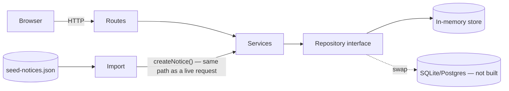

# Decisions

Sections are ordered roughly by the assessment weights.

## Stack

- SvelteKit (pnpm, Vite, Node, Svelte, `adapter-node`), single package — one dev server, one build, one deploy target, file-based routing covers pages and API.
- Styling is Tailwind CSS v4, not hand-written CSS — theme tokens in `src/app.css` (`@theme`), inline utilities in markup, a few `@utility` classes (`pin-card`, `page-frame`, `paper-form`) for patterns reused across components.
- Considered a separate Express backend + Svelte frontend; rejected — two dev servers/a proxy for no benefit given both deploy as one Node process anyway.

## Architecture

Three layers, each depending only on the one below it:

- **`routes`** (`+page.server.ts`/`+server.ts`) — thin request handlers only: parse the request, call a service, return/redirect. No business logic lives here.
- **`services`** (`src/lib/server/services/`) — the actual business logic: `createNotice`/`createReply` (dedupe, call trust & safety, write the result), `evaluateTrustAndSafety` (pure function, no I/O), `resolveAuthor`/`resolvePublicBoard`. This is the one place a rule like "what happens on a spam post" is decided.
- **`repository`** (`src/lib/server/repository/`) — data access behind an interface (`types.ts`), with one implementation today (`in-memory.ts`). Services never touch storage directly; swapping in SQLite/Postgres later means writing a second implementation of that interface, not touching services or routes.

The legacy import (`src/lib/server/import/`) is a fourth, isolated piece. It normalizes messy legacy shapes into the canonical input shape, then calls the same `createNotice()` a live HTTP request would call — so import records get the same dedupe/trust-scoring/validation as a real post, and there's no second code path to keep in sync.



Frontend components (`src/lib/components/`) mirror this separation: `NoticeCard` is presentation only; `NoticeDetailDialog` is a single shared dialog rather than per-card state (see "UI direction"); `CreateNoticeForm` and `ViewerBadge` are self-contained and don't know about each other.

### Routes

No separate REST API beyond `/health` — pages and mutations both live in SvelteKit routes.

| Route                         | Method             | Purpose                                                                  |
| ----------------------------- | ------------------ | ------------------------------------------------------------------------ |
| `/`                           | GET                | Home — lists all public neighbourhoods                                   |
| `/board/[name]`               | GET                | A neighbourhood's board — notices, create form, detail dialog            |
| `/board/[name]?/createNotice` | POST (form action) | Create a notice                                                          |
| `/board/[name]?/createReply`  | POST (form action) | Create a reply                                                           |
| `/health`                     | GET                | `{"status":"ok"}` — Render's health check, and the client's wake-up ping |

## Scope cuts (this round)

Private noticeboards + circles: schema modelled, thin slice built (public boards fully working, private access via one membership check, minimal circle-management UI — full invite flows/richer ACLs are designed, not built). No auth/login, production hardening, exhaustive tests, brand guidelines, personas, PWA, or gated CI/CD — none required by the brief (see "What I'd do with more time"). Deployment itself is in scope (a deliberate demoability addition, not a cut).

## Trust & safety direction

Every notice is checked against two signals before it's shown: whether its author is already marked verified, and a simple scan of the title/body for red flags (shouting titles, scam keywords, abusive language). This is pragmatic pattern-matching, not real moderation or NLP — but it's enough to separate ordinary posts from the spam and abuse in the legacy data.

- **Verified**: `User.verified`, resolved by `resolveAuthor()` (`src/lib/server/services/users.ts`) — set from the legacy `verified` field on import, most-restrictive-wins on conflict; defaults to unverified for a name with no existing record.
- **Heuristic flags**: `detectContentSignals()` (`src/lib/server/services/trust-safety.ts`) — regex/keyword checks against the title and body. Both signals feed into `evaluateTrustAndSafety()` (same file), which maps them to the table below.

| Verified | Heuristic flags?      | Status           | UI treatment                                           |
| -------- | --------------------- | ---------------- | ------------------------------------------------------ |
| true     | —                     | `visible`        | shown normally                                         |
| false    | no                    | `visible`        | shown, labelled "Not yet verified"                     |
| false    | yes                   | `pending_review` | excluded from public list; author still sees their own |
| —        | severe (abuse/threat) | `hidden`         | excluded entirely, logged                              |

- **Label-by-default, not hold-all-unverified**: most unverified posts in the seed data are ordinary legitimate requests; holding everything would empty the board and doesn't match the actual (content-shaped) risk.
- **Rejected**: down-ranking (conflicts with the brief's "newest first"); rate-limiting (needs session identity we don't have without auth).
- One pure function, `evaluateTrustAndSafety()`, called from both `createNotice()`/`createReply()` and the legacy import — same path regardless of source. Every flag writes a `TrustEvent` and lowers `trustScore`. Verified authors start at 70, unverified at 30 (0–100 scale).
- Applied against the legacy data: the two spam posts and the abusive post land in `pending_review`/`hidden` as expected; ordinary unverified posts stay visible with a label — confirmed by an end-to-end test.

## Data model

```
User { id, name, verified, trustScore, createdAt }

// Added for future-proofing
// Directed relation; private-board access = owner + owner's Circle
Circle { ownerId, memberId, createdAt }

Noticeboard { id, name, visibility: 'public'|'private', ownerId }

Notice {
  id, legacyId, boardId, type: 'offer'|'request'|'event'|'alert'|'other',
  title, body, authorId (nullable), createdAt,
  status: 'visible'|'pending_review'|'hidden', importFlags: string[],
  cardImageUrl: string | null, cardFont: 'marker'|'typewriter'|'handwritten'|'classic' | null
}

// Same trust & safety pipeline as Notice
Reply { id, noticeId, authorId (nullable), body, createdAt, status }

// Append-only; trustScore derives from this
TrustEvent { id, userId, delta, reason, noticeId (nullable), createdAt }
```

Author is a `User` reference, not free text, so a trust score has somewhere to live. `trustScore` derives from the append-only `TrustEvent` log rather than a mutable field, so changes carry a reason. Full schema modelled; only a thin behavioural slice built — public boards fully working, private boards enforced via one membership check, minimal UI for circle management (see "Scope cuts").

## Legacy import (`seed-notices.json`)

Two-step pipeline: a legacy-specific adapter normalizes messy records (field drift `subject`/`text`→`title`/`body`, 5 date formats, `type` casing) into the canonical shape, then hands off to `createNotice()` — the same call a live request uses, so validation/trust-scoring/dedup apply uniformly. Author identity resolved by exact trimmed name match (known limitation: two people sharing a name would merge). Conflicting `verified` flags resolve most-restrictive-wins. Duplicate notices (matching board + title + body + author) deduped — whichever is processed first is kept, no later duplicate is created; for the seed data that happens to be the earliest-timestamped copy, since records are processed in file order. Each unique neighbourhood becomes a public `Noticeboard`.

## Current-user identity

No real auth. Viewer name lives in the browser's `localStorage` (`ViewerBadge.svelte`), not a cookie — it's a device preference the server has no default need to see, doesn't gate anything, and stays out of every request. The one place the server needs it is deciding whether to include a viewer's own `pending_review` post in an SSR-rendered list, so the badge syncs it into a `?viewer=` query param via client redirect when out of sync; create/reply forms carry it forward as a hidden field since a `?/action` form target drops the rest of the query string on submit. Net effect: the must-do flows (list/create/reply) work with JS off; only "see your own held post" requires JS.

## UI direction

**Objective**: posting should feel as easy as pinning a sign to a real noticeboard — simple, seamless, welcoming, not a form.

- Visual identity via styling only (pinned/postcard cards, corkboard texture, warm palette, a wood picture-frame border at the layout level) in a normal scrollable grid — not a true interactive pan/zoom canvas, which is real engineering effort outside the grading criteria and fights the "newest first" requirement.
- Card face: poster sets an image (pasted URL, no upload infra) and a font preset (`marker`/`typewriter`/`handwritten`/`classic`); the title is the one piece of text shown on both card and detail view — no separate caption field.
- Detail view is a single shared `<dialog>` (`NoticeDetailDialog.svelte`), not per-card inline expansion — at most one notice's full detail is ever open, native `<dialog>` gives focus-trapping/`Escape`/backdrop-close for free, and a CSS `@starting-style` scale+fade animates its open/close symmetrically (the one deliberate exception to "styling is Tailwind utilities" — no utility equivalent for that feature).
- Notice creation is scoped to the board being viewed (no free-text neighbourhood field), and no longer asks for a name — both create and reply forms use the viewer identity automatically via a hidden field.
- Forms are plain `POST` actions, no `use:enhance` — deliberate, since the audience skews toward older phones/patchy connections; the app works fully with JS off, at the cost of a full-page reload per submit.
- A welcoming pass: warmer copy ("What's happening in your streets", a friendlier empty state), "Not yet verified" instead of "Unverified resident", and a softer, more consistent corner radius/pushpin shadow across the UI.

## How AI was used

- **Subagents** (Claude Code): Software Architect for the initial data model/layered architecture; Front-end Developer for initial UI component structure; UX Researcher for the noticeboard visual direction.
- **MCP server**: the `svelte` MCP server's `svelte-autofixer`, run against every new/changed component before treating it done — caught two real bugs (a stale reactive value that didn't resync on reopen; a missing `.focus()` call that left a field untypeable).
- **Project instructions** (`CLAUDE.md`): built up over the project via the `init` skill plus targeted edits — commands, architecture map, styling/accessibility conventions — so later sessions inherit context instead of re-deriving it.
- **Planning**: `docs/PLAN.md` created early, kept as a living checklist — re-prioritised mid-project against the brief's actual grading weights, updated after each feature landed with what was actually built.
- **Human-in-the-loop throughout**: every change was gated by review, not auto-applied; two real bugs were caught by actually using the app, not just automated checks; code was tweaked by hand at points along the way. Verification stayed independent — typecheck, tests, `svelte-autofixer`, and a production build before anything was called done.
- **Good DevEx as the enabler**: the same practices that make a codebase pleasant for a human — swappable architecture, colocated tests, one typecheck/format/test loop, conventions written down once in `CLAUDE.md` — are what make AI-assisted changes safe to trust: a bounded blast radius, a fast deterministic check, and a convention the AI doesn't have to re-infer each session.

## Testing

Tests are colocated with the code under test (e.g. `normalize.test.ts` beside `normalize.ts`), not a parallel `tests/` tree. 27 unit/integration tests across the repository, services, and import pipeline, including an end-to-end test running the real import against `seed-notices.json`. No route/UI test suite — not required by the brief, and the point being demonstrated is that the architecture is testable (pure functions, layered services), not full coverage.

## Storage

In-memory behind a repository interface, reseeded from `seed-notices.json` on every process start — one implementation for local dev and the deployed demo, no moving parts to maintain for a short exercise. The interface means a persistent store (SQLite/Postgres) can be plugged in later without touching services/routes; deliberately not built now since nothing in the brief requires persistence across restarts.

## Deployment (for ease of demo)

Deployed to Render's free tier — single Node process serves API + frontend, one URL, no CORS. Free tier sleeps after inactivity; the frontend pings `/health` on load to start the wake-up early. Live at https://neighbourhood-noticeboard.onrender.com.

## Accessibility

Manual pass against the app's markup and computed colour contrast (no automated audit run — see "What I'd do with more time"). Fixed: two theme colours that measured under WCAG AA contrast (darkened, now ~5.5:1+); `<html lang="en-NZ">`; a skip-to-content link ahead of the fixed viewer badge; page content in a `<main>` landmark; one consistent global `:focus-visible` outline; `aria-expanded`/`aria-controls` on the create-notice-form disclosure toggle, and `aria-haspopup="dialog"` on the "View details" trigger once that became a shared dialog rather than an inline disclosure (see "UI direction"); real `alt` text on notice images (was empty); no more skipped heading levels. Two bugs came from actually using the app rather than review: neighbourhood links weren't reachable by Tab (macOS Safari's default of only cycling form controls — fixed with explicit `tabindex="0"`, which forces inclusion regardless of that setting), and the "Set your name" field couldn't be typed into (a real focus bug — the input never received keyboard focus after replacing the button).

## Tooling

Prettier (`pnpm format`/`format:check`) with `prettier-plugin-svelte` and `prettier-plugin-tailwindcss` (auto-sorts classes), running on save in VS Code.

## What I'd do with more time

- Persistent storage (SQLite/Postgres) via the existing repository interface.
- A true interactive pan/zoom canvas noticeboard.
- Auth/login.
- A public ingestion API for third parties.
- Full circle-management UI.
- Exhaustive test coverage.
- Gated CI/CD with automated accessibility testing in the pipeline (Playwright + `@axe-core/playwright`, failing the build on a serious/critical violation).
- Production hardening (rate limiting, monitoring, a real persistent-store deploy).
- Brand guidelines and proper UX research.
- PWA features.
- AI-powered content moderation — a small self-hosted, purpose-fine-tuned LLM beyond today's pattern-matching, avoiding third-party API cost/data-sharing trade-offs.
- A moderation workflow for `pending_review`/`hidden` posts — today those statuses are only ever set, never resolved: there's no moderator view listing them, and no way to approve, reject, or reverse one. An admin queue plus actions that write a `TrustEvent` and update `Notice.status` would close that loop.
- Pagination/scalability work.
- Notice-list sorting and filters.
- A dedicated alt-text field and a full screen-reader walkthrough.
- Gamification/badges (the `TrustEvent` log is a natural base).
- Usage tracking/analytics to guide future improvement with real behaviour instead of guesswork.
